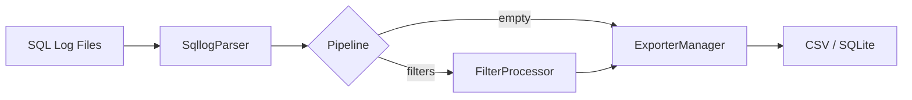
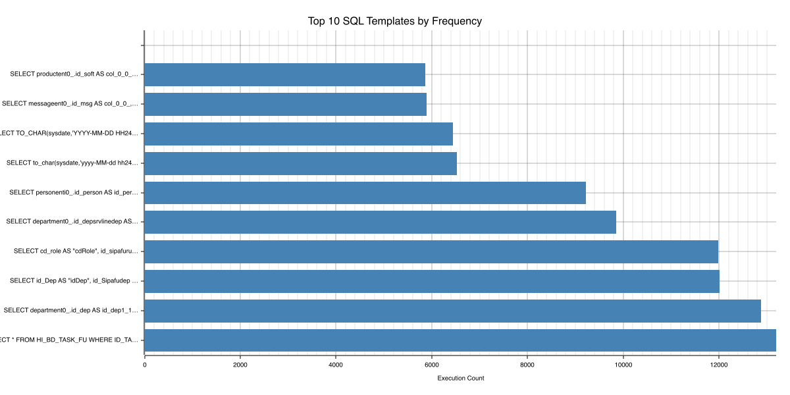
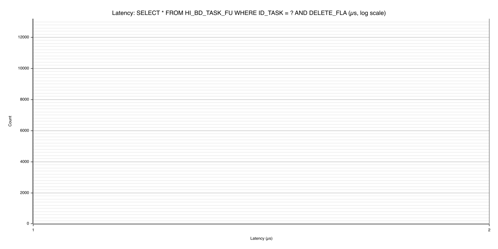

# sqllog2db

[](https://crates.io/crates/dm-database-sqllog2db)
[](https://crates.io/crates/dm-database-sqllog2db)
[](https://github.com/guangl/sqllog2db/actions/workflows/ci.yaml)
[](https://opensource.org/licenses/Apache-2.0)
[](https://github.com/guangl/sqllog2db/releases)
[](https://www.rust-lang.org/)

Parse Dameng database SQL logs and export to CSV or SQLite.

A streaming CLI tool that processes Dameng SQL log files with constant memory usage, delivering ~5.2M records/sec CSV throughput from a zero-dependency static binary. No external runtime, no database client, no JVM -- just a single ~5 MB binary that runs anywhere Rust compiles.

Use cases: log archiving, audit trail extraction, analytics preprocessing, and DBA workload profiling. The tool handles Dameng-specific log encodings (GB18030/GBK), parses structured fields from each SQL record, and routes them through an optional filtering pipeline before writing to the configured exporter.

## Features

### Parsing & Export

- **Streaming parser**: single-threaded sequential processing across one file, a directory of `.log` files, or glob patterns. Memory stays constant regardless of file size -- the tool streams records rather than loading them into RAM.
- **Flexible input modes**: single file path, directory auto-scan (recursively finds `.log` files), or glob patterns like `./logs/2025-*.log`. Results sorted by path for deterministic ordering across runs.
- **CSV exporter**: 16 MB `BufWriter` with `itoa` zero-allocation integer formatting for high-throughput, low-latency output. `memchr` SIMD-accelerated byte search handles CSV escaping.
- **SQLite exporter**: batch transactions with performance `PRAGMA` tuning (synchronous off, mmap size, cache size) and prepared statements for bulk insert throughput.
- **Priority-routed ExporterManager**: only one exporter active per run; CSV wins when both are configured. The `Exporter` trait lets benchmarks inject mock exporters without modifying production code.
- **Resume/checkpoint support**: optional state file tracks processed files by size and modification time, enabling incremental exports that skip already-completed files on subsequent runs.

### Filtering & Field Control

- **Record-level include filters** (AND semantics): every configured field must match for the record to pass. Supports user, IP, session, thread, statement type (INS/UPD/DEL/SEL), application name, tag, and timestamp range via `start_ts`/`end_ts`.
- **Record-level exclude filters** (OR-veto): any single match drops the record immediately without evaluating remaining exclude fields. Same field set as include. Include and exclude stack: include narrows the candidate set, exclude carves out exceptions.
- **Transaction-level indicator filters**: match on `exec_id`, minimum runtime (`min_runtime_ms`), or minimum row count (`min_row_count`). When a statement in a transaction matches, the entire transaction is retained. Requires two-pass pre-scan for transaction boundary detection.
- **Transaction-level SQL content filters**: string patterns in `includes` and `excludes` applied to SQL text content. Two-pass design: pre-scan collects matching transaction IDs, main pass applies the transaction set filter alongside record-level filters.
- **Field projection**: `ordered_indices: Vec<usize>` lets you select exact column order and subset from the record schema. Passed from config through the pipeline to the exporter -- no field is written unless explicitly listed.

### Template Analysis & Charts

- **SQL fingerprint normalization** (`normalize_template`): strips single-line and block comments, folds IN-list values to a single `?` placeholder, uppercases keywords, collapses whitespace. Produces a stable template key from structurally identical queries with different parameter values.
- **TemplateAggregator**: streaming statistics engine that counts occurrences per template, accumulates execution time distribution via `hdrhistogram` (compact ~24 KB per template vs. ~40 MB for a raw Vec<u64>), and records first/last timestamps alongside a representative example SQL.
- **Dual-stat output**: aggregated template data written to both a CSV summary file and a dedicated SQLite table (`sql_templates`) in a single run. No post-processing or secondary aggregation needed.
- **Four SVG chart types**: frequency bar (top-N templates by occurrence count), latency histogram (execution time distribution per template using hdrhistogram bucket boundaries), trend line (normalized template frequency over time buckets), and user pie (proportional share of queries by database user). Rendered via plotters with SVG-only backend -- no system fonts or image libraries required.
- **Config-driven chart generation**: enabled through `[template]` and `[charts]` TOML sections. Supports configurable top-N count, per-chart type toggles, and output directory.

### Configuration & Performance

- **TOML config with nested sub-tables**: v1.4+ format places `[filter.include]`, `[filter.exclude]`, `[template]`, `[charts]` as top-level sections (not nested under `[features]`). Old flat format supported through `RawFiltersFeature` intermediate struct and serde alias for backward compatibility. `validate_and_compile()` validates the final form and rejects legacy layouts.
- **Zero-overhead fast path**: when the pipeline is empty (no filters, no templates, no replace_parameters), the hot loop skips all feature gates via a single `pipeline.is_empty()` check. No virtual dispatch, no conditional branches per record in the fast path.
- **Pre-compiled filter pipeline**: `CompiledMetaFilters` and `CompiledSqlFilters` hold compiled `RegexSet` instances at startup. Each filter variant carries a type tag (include, exclude, indicator, SQL include, SQL exclude) for dispatch without string matching.
- **Single-threaded streaming**: predictable performance regardless of data volume. Uses mimalloc as global allocator. Release profile: `opt-level=3`, LTO fat, codegen-units=1, panic=abort, strip=symbols -- yielding a ~5 MB binary.
- **Benchmark results**: ~5.2M records/sec CSV (criterion, synthetic 50k-record dataset on Apple M-series), ~1.1M records/sec SQLite (batch + PRAGMA), ~1.55M records/sec on a real 1.1 GB file (~3M records, NVMe SSD).
- **Additional CLI commands**: `stats` for per-file record statistics, slow-query ranking (`--top N`), and group-by aggregation (`--group-by user,app,ip`); `digest` for SQL fingerprint aggregation with sort/filter options; `show-config` for active config inspection; `completions` and `man` for shell integration (bash, zsh, fish).

## Architecture

Data flows through the tool in four stages:

1. **Discovery**: `SqllogParser` resolves the configured path (file, directory, or glob) and produces an ordered list of `.log` files.
2. **Parsing**: Each file is streamed line by line through `dm-database-parser-sqllog`, which decodes GB18030/GBK records and extracts structured fields (user, SQL text, duration, row count, session ID, etc.).
3. **Pipeline**: Parsed records pass through an optional processing pipeline. When empty (no filters, no templates), records bypass all feature logic via a zero-overhead fast path. When active, the pipeline runs compiled regex filters and/or template normalization.
4. **Export**: The active exporter (CSV or SQLite, selected by priority) writes each record. An ExporterManager routes records to the single configured exporter.

This streaming design keeps memory usage constant -- a 100 MB log file and a 100 GB log file consume the same peak memory.



The same flow expressed textually:

```
Input .log files --> SqllogParser --> Pipeline --> ExporterManager --> CSV / SQLite
```

### Key Modules

- **`cli/run.rs`**: main orchestration -- loads config, builds pipeline, pre-scans for transaction filters, streams records file by file.
- **`exporter/mod.rs`**: `Exporter` trait and `ExporterManager` factory. Only one exporter active per run.
- **`features/mod.rs`**: `LogProcessor` trait and `Pipeline`. `pipeline.is_empty()` enables the zero-overhead fast path.
- **`features/filters.rs`**: two-pass filter design. Pre-scan finds matching transaction IDs using `CompiledMetaFilters` and `CompiledSqlFilters`.
- **`config.rs`**: all config structs with serde deserialization, nested sub-table support, and `validate_and_compile()` for pre-validation.

## Installation

### From crates.io (recommended)

```bash
cargo install dm-database-sqllog2db
```

Requires Rust 1.85+. The release binary is ~5 MB (LTO fat, stripped, panic=abort, codegen-units=1).

### Local build

```bash
cargo build --release
cargo install --path .
```

### Verify the installed binary

```bash
sqllog2db --version
sqllog2db --help
```

Check `sqllog2db completions bash`, `sqllog2db completions zsh`, or `sqllog2db completions fish` to install shell completions. Run `sqllog2db man` to generate a man page.

## QuickStart

Generate a default configuration, validate it, then run the export:

```bash
sqllog2db init -o config.toml
sqllog2db validate -c config.toml
sqllog2db run -c config.toml
```

Use `--limit N` for a quick dry-run sample and `--from`/`--to` for time-range filtering:

```bash
sqllog2db run -c config.toml --limit 1000
sqllog2db run -c config.toml --from "2025-01-01" --to "2025-12-31"
```

For per-file statistics, slow-query ranking, and SQL fingerprint aggregation:

```bash
sqllog2db stats -c config.toml --top 10
sqllog2db digest -c config.toml --sort exec --top 20
```

See also the [QuickStart Guide](./docs/quickstart.md) for detailed usage.

## Configuration

The default config generated by `sqllog2db init` uses nested TOML sub-tables for filter, template, and chart settings (v1.4+ format):

```toml
[sqllog]
path = "sqllogs"

[template]
enable = false

[filter]
enable = false

[filter.include]
# users = ["SYSDBA"]
# statements = ["INS", "UPD"]

[exporter.csv]
file = "outputs/sqllog.csv"
overwrite = true
```

A full configuration reference is available at [docs/config-reference.md](./docs/config-reference.md).

## Performance

### Benchmark Results

| Mode | Throughput | Notes |
|------|-----------|-------|
| CSV (synthetic) | ~5.2M rec/s | criterion, Apple M-series |
| SQLite (synthetic) | ~1.1M rec/s | batch + PRAGMA |
| Real file (1.1 GB, NVMe) | ~1.55M rec/s | ~3M records, production log |

Benchmarks measured with `cargo bench` on a Mac with Apple Silicon and NVMe SSD.

## SVG Charts

Two sample charts generated from real Dameng SQL logs using the built-in template analysis and chart generation pipeline:


*Top-10 SQL frequency bar chart -- most frequent query templates by occurrence count*


*Latency histogram -- execution time distribution for a selected query template*

All four chart types are available: frequency bar, latency histogram, trend line, and user pie. For additional chart samples from different datasets, see the [Gallery](https://guangl.github.io/sqllog2db/) on the project landing page (Phase 22).

## Error Handling

Parse errors are not fatal. When a log line cannot be parsed, the error is written to the configured error log file (`[error] file` in config) and processing continues with the next line. The tool uses structured error types (via `thiserror`) with file path and reason context for all error variants.

Graceful shutdown via Ctrl+C stops after the current batch completes. Exit codes: 0 (success), 2 (config error), 3 (file/parse error), 4 (export error), 130 (user interrupt).

## Links

- [GitHub Repository](https://github.com/guangl/sqllog2db)
- [crates.io](https://crates.io/crates/dm-database-sqllog2db)
- [Releases](https://github.com/guangl/sqllog2db/releases)
- [CHANGELOG](./CHANGELOG.md)
- [QuickStart Guide](./docs/quickstart.md)
- [Config Reference](./docs/config-reference.md)
- [Contributing Guide](./CONTRIBUTING.md) _(Coming v1.6)_
- [Security Policy](./SECURITY.md) _(Coming v1.6)_
- [Architecture Documentation](./docs/architecture.md) _(Coming v1.6)_

## License

Licensed under the Apache License, Version 2.0. See [LICENSE](./LICENSE) for details.
