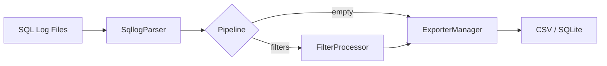

# sqllog2db

[](https://crates.io/crates/dm-database-sqllog2db)
[](https://crates.io/crates/dm-database-sqllog2db)
[](https://github.com/guangl/sqllog2db/actions/workflows/ci.yaml)
[](https://opensource.org/licenses/Apache-2.0)
[](https://github.com/guangl/sqllog2db/releases)
[](https://www.rust-lang.org/)

解析达梦数据库 SQL 日志并导出为 CSV 或 SQLite。

一款流式命令行工具，以恒定内存占用处理达梦 SQL 日志文件，从零依赖的静态二进制文件提供约 520 万条记录/秒的 CSV 吞吐量。无需外部运行时、无需数据库客户端、无需 JVM——只是一个约 5 MB 的二进制文件，可在 Rust 编译的任何平台上运行。

适用场景：日志归档、审计追踪提取、分析预处理、DBA 工作负载画像。该工具处理达梦特有的日志编码（GB18030/GBK），从每条 SQL 记录中解析结构化字段，并通过可选的处理管道将其路由后写入配置的导出器。

## 功能特性

### 解析与导出

- **流式解析器**：单线程顺序处理单个文件、目录中的 `.log` 文件或 glob 模式匹配的文件。无论文件大小，内存保持恒定——工具流式处理记录而非加载到内存中。
- **灵活的输入模式**：支持单文件路径、目录自动扫描（递归查找 `.log` 文件）或 glob 模式（如 `./logs/2025-*.log`）。结果按路径排序以在多次运行间保持确定性顺序。
- **CSV 导出器**：2 MB `BufWriter` 配合 `itoa` 零分配整数格式化，实现高吞吐、低延迟输出。`memchr` 的 SIMD 加速字节搜索处理 CSV 转义。
- **SQLite 导出器**：批量事务配合性能 `PRAGMA` 调优（synchronous off、mmap size、cache size）和预编译语句实现批量插入吞吐量。多文件场景支持 rayon 并行解析路径（`sqlite_parallel.rs`）。
- **优先级路由的 ExporterManager**：每次运行只有一个导出器处于活动状态；两者同时配置时 CSV 优先。`Exporter` trait 允许基准测试在不修改生产代码的情况下注入模拟导出器。

### 过滤与字段控制

- **记录级包含过滤器**（AND 语义）：每条记录必须匹配每个配置的字段才能通过。支持用户名、IP、会话、线程、语句类型（INS/UPD/DEL/SEL）、应用名称、标签以及通过 `start_ts`/`end_ts` 设定的时间戳范围。
- **记录级排除过滤器**（OR 否决）：任意单次匹配立即丢弃记录，不继续评估剩余的排除字段。字段集与包含过滤器相同。包含和排除叠加：包含缩小候选集，排除剔除例外项。
- **事务级指标过滤器**：匹配 `exec_id`、最小执行时长（`min_runtime_ms`）或最小行数（`min_row_count`）。当事务中某条语句匹配时，整个事务被保留。需要两遍预扫描以检测事务边界。
- **事务级 SQL 内容过滤器**：应用于 SQL 文本内容的字符串模式（`includes` 和 `excludes`）。两遍设计：预扫描收集匹配的事务 ID，主遍将事务集过滤器与记录级过滤器一起应用。
- **字段投影**：`ordered_indices: Vec<usize>` 允许你从记录模式中选择精确的列顺序和子集。从配置通过管道传递到导出器——未在列表中显式声明的字段不会被写入。

### 配置与性能

- **嵌套子表的 TOML 配置**：v1.4+ 格式将 `[filter.include]`、`[filter.exclude]` 作为顶级节（而非嵌套在 `[features]` 下）。旧的扁平格式通过 `RawFiltersFeature` 中间结构和 serde 别名支持向后兼容。`validate_and_compile()` 验证最终形式并拒绝旧版布局。
- **零开销快速路径**：当管道为空（无过滤器、无 replace_parameters）时，热循环通过单个 `pipeline.is_empty()` 检查跳过所有功能门控。快速路径中无虚函数调用、无逐记录的条件分支。
- **预编译的过滤器处理管道**：`CompiledMetaFilters` 和 `CompiledSqlFilters` 在启动时持有编译好的 `RegexSet` 实例。每个过滤器变体带有类型标签（include、exclude、indicator、SQL include、SQL exclude），无需字符串匹配即可派发。
- **单线程流式处理**：无论数据量大小，性能可预测。使用标准库全局分配器。Release 配置：`opt-level=3`、LTO fat、codegen-units=1、panic=abort、strip=symbols——生成约 5 MB 的二进制文件。
- **基准测试结果**：~520 万条记录/秒 CSV（criterion，合成 50k 记录数据集，Apple M 系列芯片），~110 万条记录/秒 SQLite（batch + PRAGMA），~155 万条记录/秒（真实 1.1 GB 文件，约 300 万条记录，NVMe SSD）。
- **简洁的 CLI**：`init`（生成配置）、`validate`（校验）、`run`（执行导出）、`stats`（统计分析）四个命令。

## 架构

数据通过四个阶段流经工具：

1. **发现**：`SqllogParser` 解析配置的路径（文件、目录或 glob）并生成有序的 `.log` 文件列表。
2. **解析**：每个文件通过 `dm-database-parser-sqllog` 逐行流式读取，解码 GB18030/GBK 记录并提取结构化字段（用户、SQL 文本、执行时长、行数、会话 ID 等）。
3. **处理管道**：解析后的记录通过可选的处理管道。当管道为空（无过滤器）时，记录通过零开销快速路径绕过所有功能逻辑。当管道活跃时，运行编译好的正则过滤器。
4. **导出**：活跃的导出器（CSV 或 SQLite，按优先级选择）写入每条记录。ExporterManager 将记录路由到单一配置的导出器。

这种流式设计保持内存使用恒定——100 MB 日志文件和 100 GB 日志文件消耗相同的峰值内存。



同样的流程以文本形式表达：

```
输入 .log 文件 --> SqllogParser --> 处理管道 --> ExporterManager --> CSV / SQLite
```

### 关键模块

- **`cli/run/mod.rs`**：主编排——加载配置、构建管道、预扫描事务过滤器、逐个文件流式处理记录。
- **`cli/run/sqlite_parallel.rs`**：SQLite 导出的多文件并行解析路径（基于 rayon），解析错误通过 `log::warn!` 上报。
- **`cli/stats/mod.rs`**：`stats` 子命令入口，委托给 `src/stats/` 完成聚合与写出。
- **`stats/mod.rs`**：`run_stats` 流式扫描 → `StatsAccumulator` → 写入 `slow_sql.csv` / `frequent_sql.csv`（或 SQLite 表）。
- **`exporter/mod.rs`**：`Exporter` trait 和 `ExporterManager` 工厂。每次运行只有一个导出器处于活动状态。
- **`pipeline/mod.rs`**：`LogProcessor` trait 和 `Pipeline`。`pipeline.is_empty()` 启用零开销快速路径。
- **`pipeline/filters/mod.rs`**：两遍过滤器设计。预扫描使用 `CompiledMetaFilters` 和 `CompiledSqlFilters` 查找匹配的事务 ID。
- **`config.rs`**：所有配置结构体，支持 serde 反序列化、嵌套子表支持和 `validate_and_compile()` 预验证。

## 安装

### 从 crates.io 安装（推荐）

```bash
cargo install dm-database-sqllog2db
```

需要 Rust 1.85+。Release 二进制文件约 5 MB（LTO fat、stripped、panic=abort、codegen-units=1）。

### 本地构建

```bash
cargo build --release
cargo install --path .
```

### 验证安装的二进制文件

```bash
sqllog2db --version
sqllog2db --help
```

## 快速入门

生成默认配置，验证后运行导出：

```bash
sqllog2db init -o config.toml
sqllog2db validate -c config.toml
sqllog2db run -c config.toml
```

统计分析慢 SQL 和高频 SQL（输出到 `slow_sql.csv` / `frequent_sql.csv`）：

```bash
sqllog2db stats -c config.toml
sqllog2db stats -c config.toml --top 10
```

指定时间范围统计（v1.14+，仅聚合 `ts` 字段落入 `--from` 与 `--to` 区间的记录）：

```bash
sqllog2db stats -c config.toml --from 2024-01-01 --to 2024-01-31
sqllog2db stats -c config.toml --from "2024-01-01 00:00:00" --to "2024-01-31 23:59:59" --top 20
```

详细用法参见[快速入门指南](./docs/quickstart.md)。

## 配置

`sqllog2db init` 生成的默认配置使用嵌套 TOML 子表来设置过滤器选项（v1.4+ 格式）：

```toml
[sqllog]
inputs = ["sqllogs"]

[filter]
enable = false

[filter.include]
# users = ["SYSDBA"]
# statements = ["INS", "UPD"]

[exporter.csv]
file = "outputs/sqllog.csv"
overwrite = true
```

完整配置参考请参见 [docs/config-reference.md](./docs/config-reference.md)。

## 性能

### 基准测试结果

| 模式 | 吞吐量 | 备注 |
|------|--------|------|
| CSV（合成数据） | ~520 万条/秒 | criterion，Apple M 系列芯片 |
| SQLite（合成数据） | ~110 万条/秒 | batch + PRAGMA |
| 真实文件（1.1 GB，NVMe） | ~155 万条/秒 | ~300 万条记录，生产日志 |

基准测试使用 `cargo bench` 在搭载 Apple Silicon 和 NVMe SSD 的 Mac 上测量。

## 错误处理

解析错误不是致命的。当日志行无法解析时，错误信息写入配置的错误日志文件（配置中的 `[error] file`），处理继续到下一条行。该工具使用结构化错误类型（通过 `thiserror`）为所有错误变体提供文件路径和原因上下文。

通过 Ctrl+C 优雅关闭会在当前批次完成后停止。退出码：0（成功）、2（配置错误）、3（文件/解析错误）、4（导出错误）、130（用户中断）。

## 版本亮点

### v1.15.0 — CI/CD 修复（2026-06-02）

- 修复 `ci.yaml`、`bench.yml`、`lychee.yml`、`pages.yml` 中误升级的 `actions/checkout@v6` 与 `actions/upload-artifact@v7`，全部回退到 `@v4`（Phase 55）
- 新增 `Cross.toml`，将 aarch64-linux 跨编译镜像 `ghcr.io/cross-rs/aarch64-unknown-linux-gnu` 锁定到 SHA256 摘要，保证可复现构建（Phase 55 + Phase 61）
- 重构 `release.yaml`：拆出独立 `create-release` job 在 4 个 matrix 构建 job 之前运行，消除并行写入 release body 的竞争条件（Phase 55）
- `cli/run` 模块重构：`handle_run` 拆分为 7 个私有辅助函数，`run_sequential` 压缩到 ≤40 行，并新建 `scanner` 公共扫描模块（Phase 58 + Phase 56）

## 链接

- [GitHub 仓库](https://github.com/guangl/sqllog2db)
- [crates.io](https://crates.io/crates/dm-database-sqllog2db)
- [发布页](https://github.com/guangl/sqllog2db/releases)
- [变更日志](./CHANGELOG.md)
- [快速入门指南](./docs/quickstart.md)
- [配置参考](./docs/config-reference.md)
- [贡献指南](./CONTRIBUTING.md)
- [安全策略](./SECURITY.md)
- [架构文档](./docs/architecture.md)

## 许可证

基于 Apache License, Version 2.0 许可。详见 [LICENSE](./LICENSE)。
E)。
