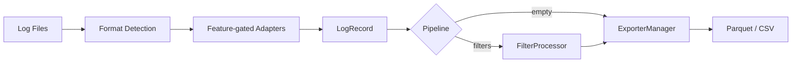

# sqllog2db

[](https://crates.io/crates/dm-database-sqllog2db)
[](https://crates.io/crates/dm-database-sqllog2db)
[](https://github.com/guangl/sqllog2db/actions/workflows/ci.yaml)
[](https://opensource.org/licenses/Apache-2.0)
[](https://github.com/guangl/sqllog2db/releases)
[](https://www.rust-lang.org/)

解析达梦数据库 SQL 日志并导出为 Parquet 或 CSV。Parquet 是默认格式。

> **维护说明**：本仓库不保证积极运维，后续更新将跟随上游解析器版本迭代进行同步。

一款流式命令行工具，以有界内存占用处理达梦 SQL 日志文件，CSV 路径可提供约 520 万条记录/秒的吞吐量。无需外部运行时、数据库客户端或 JVM。

适用场景：日志归档、审计追踪提取、分析预处理、DBA 工作负载画像。该工具处理达梦特有的日志编码（GB18030/GBK），从每条 SQL 记录中解析结构化字段，并通过可选的处理管道将其路由后写入配置的导出器。

## 功能特性

### 解析与导出

- **流式解析器**：单线程顺序处理单个文件、目录中的 `.log` 文件或 glob 模式匹配的文件。无论文件大小，内存保持恒定——工具流式处理记录而非加载到内存中。
- **灵活的输入模式**：支持单文件路径、目录自动扫描（递归查找 `.log` 文件）或 glob 模式（如 `./logs/2025-*.log`）。结果按路径排序以在多次运行间保持确定性顺序。
- **Parquet 导出器（默认）**：按 row group 流式写入，默认使用 ZSTD level 1 压缩；也支持 Snappy 和不压缩。可直接供 DuckDB、Spark、Polars 和 Pandas 分析。
- **CSV 导出器**：1 MiB `BufWriter` 配合 `itoa` 零分配整数格式化，实现高吞吐、低延迟输出。`memchr` 的 SIMD 加速字节搜索处理 CSV 转义。CSV 和 Parquet 共用有界解析队列、单写入器及进度条，按顺序输出单个文件。
- **优先级路由的 ExporterManager**：每次运行只有一个导出器处于活动状态；多个同时配置时按 Parquet > CSV 选择。

### 过滤与字段控制

- **记录级包含过滤器**（AND 语义）：每条记录必须匹配每个配置的字段才能通过。支持用户名、IP、会话、线程、语句类型（INS/UPD/DEL/SEL/ORA 等，匹配日志方括号标签，取不带方括号的值如 `SEL`）、应用名称、标签以及通过 `start_ts`/`end_ts` 设定的时间戳范围。语句类型统一使用 `tags`。
- **记录级排除过滤器**（OR 否决）：任意单次匹配立即丢弃记录，不继续评估剩余的排除字段。字段集与包含过滤器相同。包含和排除叠加：包含缩小候选集，排除剔除例外项。
- **事务级指标过滤器**：匹配 `exec_id`、最小执行时长（`min_runtime_ms`）或最小行数（`min_row_count`）。当事务中某条语句匹配时，整个事务被保留。需要两遍预扫描以检测事务边界。
- **事务级 SQL 内容过滤器**：应用于 SQL 文本内容的字符串模式（`includes` 和 `excludes`）。两遍设计：预扫描收集匹配的事务 ID，主遍将事务集过滤器与记录级过滤器一起应用。
- **字段投影**：`ordered_indices: Vec<usize>` 允许你从记录模式中选择精确的列顺序和子集。从配置通过管道传递到导出器——未在列表中显式声明的字段不会被写入。

### 配置与性能

- **两组过滤配置**：`[filter.include]` 保留、`[filter.exclude]` 排除，SQL 和指标直接放入对应组，配置后自动生效。旧字段和未知字段在加载时直接报错，迁移方法见配置参考。
- **零开销快速路径**：当管道为空（无过滤器、无 replace_parameters）时，热循环通过单个 `pipeline.is_empty()` 检查跳过所有功能门控。快速路径中无虚函数调用、无逐记录的条件分支。
- **统一过滤管道**：元数据使用精确匹配，SQL 使用字面量子串匹配。SQL 与指标共用 `TransactionFilters`，预扫描分别收集保留和排除的事务 ID，正式扫描按集合过滤。
- **单线程流式处理**：无论数据量大小，性能可预测。Parquet 批次同时受行数和约 64 MiB 字节预算限制。Release 配置：`opt-level=3`、LTO fat、codegen-units=1、panic=abort、strip=symbols。
- **基准测试结果**：~520 万条记录/秒 CSV（criterion，合成 50k 记录数据集，Apple M 系列芯片），~155 万条记录/秒（真实 1.1 GB 文件，约 300 万条记录，NVMe SSD）。
- **简洁的 CLI**：`init`（生成配置）、`validate`（校验）、`run`（执行导出）、`stats`（统计分析）四个命令。

### 可选解析器 features

解析器依赖按 Cargo feature 隔离，解析结果先统一为内部 `LogRecord`，过滤、统计和导出层不依赖任何具体解析器。默认构建启用传统 SQL 日志和 JDBC 驱动日志：

| Feature | 输入格式 |
| --- | --- |
| `sqllog` | 达梦传统 SQL 日志，依赖 `dm-database-parser-sqllog` |
| `driver-jdbc` | JDBC 驱动日志，依赖 `dm-database-driver-log = "0.1.1"` 的 `jdbc` feature |
| `driver-dm-provider` | DM Provider 驱动日志，依赖 `dm-database-driver-log = "0.1.1"` 的 `dm-provider` feature |
| `all-parsers` | 启用上面全部解析器 |

按部署场景裁剪构建：

```bash
cargo build --release --no-default-features --features sqllog
cargo build --release --no-default-features --features driver-jdbc
cargo build --release --no-default-features --features driver-dm-provider
cargo build --release --no-default-features --features all-parsers
```

输入文件会根据首条非空记录自动选择适配器。后续增加新的日志格式时，只需增加对应 feature、在 `src/infrastructure/input/adapters/` 下实现适配器，并把源字段映射到 `LogRecord`，核心处理链无需改动。

## 架构

数据通过四个阶段流经工具：

1. **发现**：`InputResolver` 展开配置的路径（文件、目录或 glob）并生成有序的 `.log` 文件列表。
2. **解析**：每个文件自动识别格式后流式读取：传统 SQL 日志使用 `dm-database-parser-sqllog`，JDBC 驱动日志使用 `dm-database-driver-log`。两种输入都会适配到统一记录模型，再提取用户、SQL 文本、执行时长、行数、会话 ID 等字段。
3. **处理管道**：解析后的记录通过可选的处理管道。当管道为空（无过滤器）时，记录通过零开销快速路径绕过所有功能逻辑。当管道活跃时，运行编译好的正则过滤器。
4. **导出**：活跃的导出器（Parquet 或 CSV，按优先级选择）写入每条记录。ExporterManager 将记录路由到单一配置的导出器。

这种流式设计保持内存使用恒定——100 MB 日志文件和 100 GB 日志文件消耗相同的峰值内存。



同样的流程以文本形式表达：

```
输入 .log 文件 --> 格式识别 --> 解析器适配器 --> LogRecord --> 处理管道 --> ExporterManager --> Parquet / CSV
```

### 关键模块

项目目录与阅读顺序见[架构说明](docs/architecture.md)。所有测试位于 `tests/`，文档站与说明统一位于 `docs/`。

- **`application/engine/mod.rs`**：主编排——加载配置、构建管道、预扫描事务过滤器、逐个文件流式处理记录。
- **`cli/stats.rs`**：`stats` 子命令入口，委托给 `src/stats/` 完成聚合与终端展示。
- **`stats/mod.rs`**：`run_stats` 流式扫描 → `StatsAccumulator` → 在终端打印慢 SQL 与高频 SQL。
- **`infrastructure/output/mod.rs`**：`Exporter` trait 和 `ExporterManager` 工厂。每次运行只有一个导出器处于活动状态。
- **`domain/model.rs`**：与解析器无关的 `LogRecord` 领域模型，作为处理链唯一的记录类型。
- **`infrastructure/input/mod.rs`**：识别输入格式、编排有界预取，并把记录交给 feature-gated 适配器。
- **`infrastructure/input/resolver.rs`**：展开文件、目录和 glob 输入，保持路径发现与具体日志格式无关。
- **`infrastructure/input/adapters/sql_log.rs`、`infrastructure/input/adapters/driver_log.rs`**：分别封装 SQL 日志和驱动日志依赖；新增解析器在这里扩展。
- **`domain/pipeline/mod.rs`**：`LogProcessor` trait 和 `Pipeline`。`pipeline.is_empty()` 启用零开销快速路径。
- **`domain/pipeline/filters/mod.rs`**：两遍过滤器设计。`TransactionFilters` 统一匹配 include/exclude 的 SQL 与指标条件，预扫描汇总事务 ID 后应用排除。
- **`config/mod.rs`**：所有配置结构体，支持 serde 反序列化、嵌套子表支持和 `validate()` 校验。

## 安装

### 下载预编译二进制文件

可从 [GitHub Releases](https://github.com/guangl/sqllog2db/releases) 下载 Linux、macOS 或 Windows 版本。官方预编译 Linux 二进制文件在 Debian 10（buster）环境中构建，运行时需要 **glibc 2.28 或更高版本**；不支持 musl libc。在旧版 glibc 或 musl 系统上，请使用下方的 `cargo install` 或本地构建方式。

### 从 crates.io 安装（推荐）

```bash
cargo install dm-database-sqllog2db
```

需要 Rust 1.95+。Release 使用 LTO fat、stripped、panic=abort 和 codegen-units=1。

### 作为 dameng-cli 插件安装

需要 `dameng-cli` 0.2.0+ 和 Rust 1.95+。从源码目录安装时，插件会声明文件系统权限，用于读取 SQL 日志、配置以及写入导出文件：

```bash
dm install . --accept-permissions
dm sqllog2db --help
```

也可以固定 Git 标签或完整提交安装：

```bash
dm install https://github.com/guangl/sqllog2db.git --rev <tag-or-commit> --accept-permissions
```

插件入口与独立命令共享全部参数、标准输入输出和退出码，因此 `sqllog2db run ...` 可直接改写为 `dm sqllog2db run ...`。宿主会保留 `SQLLOG2DB_CONFIG` 与 `RUST_LOG` 环境变量；其他配置和输入输出路径仍按调用 `dm` 时的当前目录解析。

### 本地构建

```bash
cargo build --release
cargo install --path .
```

### 验证安装的二进制文件

```bash
sqllog2db --version
sqllog2db --help
```

## 快速入门

生成默认配置，验证后运行导出：

```bash
sqllog2db init -o config.toml
sqllog2db validate -c config.toml
sqllog2db run -c config.toml
```

统计分析慢 SQL 和高频 SQL（结果直接打印在终端）：

```bash
sqllog2db stats -c config.toml
sqllog2db stats -c config.toml --top 10
```

指定时间范围统计（v1.14+，仅聚合 `ts` 字段落入 `--from` 与 `--to` 区间的记录）：

```bash
sqllog2db stats -c config.toml --from 2024-01-01 --to 2024-01-31
sqllog2db stats -c config.toml --from "2024-01-01 00:00:00" --to "2024-01-31 23:59:59" --top 20
```

交互式向导生成配置文件（每步显示示例值与默认值，回车接受默认值）：

```bash
sqllog2db init --interactive
```

进度输出控制：`-q`/`--quiet` 抑制非错误输出（适合后台/定时任务），`-v`/`--verbose` 显示每文件详情：

```bash
sqllog2db run -c config.toml --quiet
sqllog2db run -c config.toml --verbose
```

详细用法参见[快速入门指南](./docs/quickstart.md)。

## 配置

所有配置段均按是否存在生效。省略 replace_parameters 不替换参数；启用时默认仅对 `SEL` 回填，可用 `tags` 指定其他日志标签。省略 logging 时日志输出到 stdout，不写日志文件，省略 exporter 不默认选择导出器。`sqllog2db init` 显式生成输入和一个导出器，可选功能以注释展示：

```toml
[sqllog]
inputs = ["sqllogs"]

[filter.include]
# users = ["SYSDBA"]
# tags = ["INS", "UPD"]
# min_runtime_ms = 1000

[filter.exclude]
# sql = ["SELECT 1"]

[exporter.parquet]
file = "outputs/sqllog.parquet"
overwrite = true
compression = "zstd"
row_group_rows = 65536
```

完整配置参考请参见 [docs/config-reference.md](./docs/config-reference.md)。

## 性能

### 基准测试结果

| 模式 | 吞吐量 | 备注 |
|------|--------|------|
| CSV（合成数据） | ~520 万条/秒 | criterion，Apple M 系列芯片 |
| 真实文件（1.1 GB，NVMe） | ~155 万条/秒 | ~300 万条记录，生产日志 |

基准测试使用 `cargo bench` 在搭载 Apple Silicon 和 NVMe SSD 的 Mac 上测量。

## 错误处理

解析错误不是致命的。当日志行无法解析时，错误信息写入配置的错误日志文件（配置中的 `[error] file`），处理继续到下一条行。该工具使用结构化错误类型（通过 `thiserror`）为所有错误变体提供文件路径和原因上下文。

通过 Ctrl+C 优雅关闭会在当前批次完成后停止。退出码：0（成功）、1（处理完成但有非致命错误）、2（致命错误，包含配置/文件/解析/导出）、130（用户中断）。

## 版本亮点

### v2.0.0 — 配置按需启用

- filter 统一为 include/exclude，SQL 和指标直接写入对应组。
- replace_parameters 配置段存在即启用，删除 enable 与旧过滤字段。
- 日志默认输出 stdout，只有填写 logging.file 才写文件。
- 默认不配置输入、导出器或可选功能；init 显式生成输入和 Parquet 导出配置。
- 升级前请按[配置迁移说明](./docs/config-reference.md)调整旧配置。

### v1.21.0 — CSV 分片与发布质量门禁（2026-09-11）

- **CSV 自动分片（已移除）**：该版本曾支持 `max_rows_per_file`，当前版本已统一为单文件输出。
- **stats 终端输出**：无需配置导出器即可查看慢 SQL 和高频 SQL
- **过滤修复**：`statements` 按日志标签正确匹配
- **质量门禁**：发布前校验覆盖率、MSRV、发布包、内存峰值和导出完整性
- **Linux 运行环境**：官方预编译二进制文件需要 glibc 2.28+，不支持 musl libc

### v1.20.0 — 性能全面提升（2026-06-11）

- **tokio 异步解析**：全解析路径迁移 `dm-database-parser-sqllog` async API，`block_in_place` 保持并行性能
- **热路径零分配**：normalizer ParamBuffer 二级化，DML 查询从 `String::clone` 改为 `&str` 零分配查询
- **冷启动优化**：`--version` 2.1ms（较 v1.9 ~3ms 降 0.7ms），criterion baseline 存档支持版本间回归对比
- **重复代码消除**：`record_iter::iterate_records` 共享模块净消除 ~80 行并行路径重复代码

### v1.16.0 — SQL 统计分析与全面体验升级（2026-06-07）

- **`stats` 子命令**：慢 SQL TOP-N + 高频 SQL TOP-N，支持 `--from`/`--to` 时间段过滤，SQL 字面量标准化归一
- **`init --interactive` 向导**：对话式配置生成，每步提示默认值，Enter 直接接受
- **进度条升级**：`[N/M]` 文件计数器 + ETA + records/sec；错误诊断按类型分组 + hint
- **多文件 CSV 并行**：rayon 并行路径与单线程输出等价，自动激活
- **代码质量**：10 个 `mod.rs` 拆分为命名子模块；行覆盖率 92.06%；全代码库 unwrap 注释审计

## 链接

- [GitHub 仓库](https://github.com/guangl/sqllog2db)
- [crates.io](https://crates.io/crates/dm-database-sqllog2db)
- [发布页](https://github.com/guangl/sqllog2db/releases)
- [变更日志](./CHANGELOG.md)
- [快速入门指南](./docs/quickstart.md)
- [配置参考](./docs/config-reference.md)
- [贡献指南](./CONTRIBUTING.md)
- [安全策略](./SECURITY.md)
- [架构文档](./docs/architecture.md)

## 许可证

基于 Apache License, Version 2.0 许可。详见 [LICENSE](./LICENSE)。
