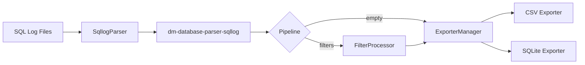

# sqllog2db

[](https://crates.io/crates/dm-database-sqllog2db)
[](https://github.com/guangl/sqllog2db/actions/workflows/ci.yaml)
[](https://opensource.org/licenses/Apache-2.0)
[](https://github.com/guangl/sqllog2db/releases)
[](https://www.rust-lang.org/)

**High-performance SQL log parser for DaMeng Database** — stream millions of records with constant memory, export to CSV or SQLite, analyze query patterns with built-in charts.

---

<!-- Install -->

## Installation

```bash
# From crates.io (recommended)
cargo install dm-database-sqllog2db

# Or build from source
cargo build --release
```

Requires Rust 1.85+. Binary size ~5 MB.

---

<!-- Features -->

## Feature Overview

**Parsing & Export** — Stream DaMeng SQL logs (GB18030/GBK), export to CSV (16 MB BufWriter + itoa zero-alloc) or SQLite (batch + PRAGMA). Single-threaded, constant memory.

**Filtering & Field Control** — Include/exclude filters with AND/OR-veto semantics. Transaction-level indicator and SQL content filters. Custom field projection via `ordered_indices`.

**Template Analysis & Charts** — SQL fingerprint normalization, TemplateAggregator with hdrhistogram statistics, dual CSV+SQLite output. Four SVG chart types generated automatically.

**Configuration & Performance** — TOML config with nested sub-tables (`[filter.include]`, `[template]`, `[charts]`). Zero-overhead fast path when pipeline is empty. ~5.2M records/sec CSV throughput.

---

<!-- Architecture -->

## Architecture



Data flows through four stages: **Discovery** → **Parsing** → **Pipeline** (optional filters) → **Export**. A zero-overhead fast path bypasses all feature logic when the pipeline is empty.

---

<!-- Performance -->

## Performance

| Benchmark | Records/sec | Data Source | Hardware |
|-----------|-------------|-------------|----------|
| CSV (synthetic) | ~5,200,000 rec/s | Criterion benchmark, 50k records | Apple M-series NVMe SSD |
| Real-world (1.1 GB) | ~1,550,000 rec/s | Production .log file, ~3M records | Apple M-series NVMe SSD |

All benchmarks run on Apple Silicon (macOS) with NVMe SSD. The streaming architecture keeps memory constant regardless of file size — a 100 MB and 100 GB log file use the same peak RAM.

---

<!-- SVG Gallery -->

## SVG Chart Gallery

Four chart types are generated from template analysis data. Each chart is rendered as SVG by the plotters library with zero system dependencies.


<details open>
<summary><b>Frequency Bar Chart</b> — Top-N SQL templates by occurrence count</summary>

Most frequent query templates ranked by execution count. Use `sqllog2db stats --chart frequency` to generate. Ideal for identifying hot queries and workload patterns.

<svg width="1200" height="600" viewBox="0 0 1200 600" xmlns="http://www.w3.org/2000/svg">
<rect x="0" y="0" width="1200" height="600" opacity="1" fill="#FFFFFF" stroke="none"/>
<text x="600" y="25" dy="0.76em" text-anchor="middle" font-family="sans-serif" font-size="16.129032258064516" opacity="1" fill="#000000">
Top 10 SQL Templates by Frequency
</text>
<line opacity="0.1" stroke="#000000" stroke-width="1" x1="220" y1="539" x2="220" y2="46"/>
<line opacity="0.1" stroke="#000000" stroke-width="1" x1="234" y1="539" x2="234" y2="46"/>
<line opacity="0.1" stroke="#000000" stroke-width="1" x1="249" y1="539" x2="249" y2="46"/>
<line opacity="0.1" stroke="#000000" stroke-width="1" x1="263" y1="539" x2="263" y2="46"/>
<line opacity="0.1" stroke="#000000" stroke-width="1" x1="278" y1="539" x2="278" y2="46"/>
<line opacity="0.1" stroke="#000000" stroke-width="1" x1="292" y1="539" x2="292" y2="46"/>
<line opacity="0.1" stroke="#000000" stroke-width="1" x1="307" y1="539" x2="307" y2="46"/>
<line opacity="0.1" stroke="#000000" stroke-width="1" x1="321" y1="539" x2="321" y2="46"/>
<line opacity="0.1" stroke="#000000" stroke-width="1" x1="336" y1="539" x2="336" y2="46"/>
<line opacity="0.1" stroke="#000000" stroke-width="1" x1="350" y1="539" x2="350" y2="46"/>
<line opacity="0.1" stroke="#000000" stroke-width="1" x1="365" y1="539" x2="365" y2="46"/>
<line opacity="0.1" stroke="#000000" stroke-width="1" x1="379" y1="539" x2="379" y2="46"/>
<line opacity="0.1" stroke="#000000" stroke-width="1" x1="394" y1="539" x2="394" y2="46"/>
<line opacity="0.1" stroke="#000000" stroke-width="1" x1="409" y1="539" x2="409" y2="46"/>
<line opacity="0.1" stroke="#000000" stroke-width="1" x1="423" y1="539" x2="423" y2="46"/>
<line opacity="0.1" stroke="#000000" stroke-width="1" x1="438" y1="539" x2="438" y2="46"/>
<line opacity="0.1" stroke="#000000" stroke-width="1" x1="452" y1="539" x2="452" y2="46"/>
<line opacity="0.1" stroke="#000000" stroke-width="1" x1="467" y1="539" x2="467" y2="46"/>
<line opacity="0.1" stroke="#000000" stroke-width="1" x1="481" y1="539" x2="481" y2="46"/>
<line opacity="0.1" stroke="#000000" stroke-width="1" x1="496" y1="539" x2="496" y2="46"/>
<line opacity="0.1" stroke="#000000" stroke-width="1" x1="510" y1="539" x2="510" y2="46"/>
<line opacity="0.1" stroke="#000000" stroke-width="1" x1="525" y1="539" x2="525" y2="46"/>
<line opacity="0.1" stroke="#000000" stroke-width="1" x1="539" y1="539" x2="539" y2="46"/>
<line opacity="0.1" stroke="#000000" stroke-width="1" x1="554" y1="539" x2="554" y2="46"/>
<line opacity="0.1" stroke="#000000" stroke-width="1" x1="569" y1="539" x2="569" y2="46"/>
<line opacity="0.1" stroke="#000000" stroke-width="1" x1="583" y1="539" x2="583" y2="46"/>
<line opacity="0.1" stroke="#000000" stroke-width="1" x1="598" y1="539" x2="598" y2="46"/>
<line opacity="0.1" stroke="#000000" stroke-width="1" x1="612" y1="539" x2="612" y2="46"/>
<line opacity="0.1" stroke="#000000" stroke-width="1" x1="627" y1="539" x2="627" y2="46"/>
<line opacity="0.1" stroke="#000000" stroke-width="1" x1="641" y1="539" x2="641" y2="46"/>
<line opacity="0.1" stroke="#000000" stroke-width="1" x1="656" y1="539" x2="656" y2="46"/>
<line opacity="0.1" stroke="#000000" stroke-width="1" x1="670" y1="539" x2="670" y2="46"/>
<line opacity="0.1" stroke="#000000" stroke-width="1" x1="685" y1="539" x2="685" y2="46"/>
<line opacity="0.1" stroke="#000000" stroke-width="1" x1="699" y1="539" x2="699" y2="46"/>
<line opacity="0.1" stroke="#000000" stroke-width="1" x1="714" y1="539" x2="714" y2="46"/>
<line opacity="0.1" stroke="#000000" stroke-width="1" x1="729" y1="539" x2="729" y2="46"/>
<line opacity="0.1" stroke="#000000" stroke-width="1" x1="743" y1="539" x2="743" y2="46"/>
<line opacity="0.1" stroke="#000000" stroke-width="1" x1="758" y1="539" x2="758" y2="46"/>
<line opacity="0.1" stroke="#000000" stroke-width="1" x1="772" y1="539" x2="772" y2="46"/>
<line opacity="0.1" stroke="#000000" stroke-width="1" x1="787" y1="539" x2="787" y2="46"/>
<line opacity="0.1" stroke="#000000" stroke-width="1" x1="801" y1="539" x2="801" y2="46"/>
<line opacity="0.1" stroke="#000000" stroke-width="1" x1="816" y1="539" x2="816" y2="46"/>
<line opacity="0.1" stroke="#000000" stroke-width="1" x1="830" y1="539" x2="830" y2="46"/>
<line opacity="0.1" stroke="#000000" stroke-width="1" x1="845" y1="539" x2="845" y2="46"/>
<line opacity="0.1" stroke="#000000" stroke-width="1" x1="859" y1="539" x2="859" y2="46"/>
<line opacity="0.1" stroke="#000000" stroke-width="1" x1="874" y1="539" x2="874" y2="46"/>
<line opacity="0.1" stroke="#000000" stroke-width="1" x1="889" y1="539" x2="889" y2="46"/>
<line opacity="0.1" stroke="#000000" stroke-width="1" x1="903" y1="539" x2="903" y2="46"/>
<line opacity="0.1" stroke="#000000" stroke-width="1" x1="918" y1="539" x2="918" y2="46"/>
<line opacity="0.1" stroke="#000000" stroke-width="1" x1="932" y1="539" x2="932" y2="46"/>
<line opacity="0.1" stroke="#000000" stroke-width="1" x1="947" y1="539" x2="947" y2="46"/>
<line opacity="0.1" stroke="#000000" stroke-width="1" x1="961" y1="539" x2="961" y2="46"/>
<line opacity="0.1" stroke="#000000" stroke-width="1" x1="976" y1="539" x2="976" y2="46"/>
<line opacity="0.1" stroke="#000000" stroke-width="1" x1="990" y1="539" x2="990" y2="46"/>
<line opacity="0.1" stroke="#000000" stroke-width="1" x1="1005" y1="539" x2="1005" y2="46"/>
<line opacity="0.1" stroke="#000000" stroke-width="1" x1="1019" y1="539" x2="1019" y2="46"/>
<line opacity="0.1" stroke="#000000" stroke-width="1" x1="1034" y1="539" x2="1034" y2="46"/>
<line opacity="0.1" stroke="#000000" stroke-width="1" x1="1048" y1="539" x2="1048" y2="46"/>
<line opacity="0.1" stroke="#000000" stroke-width="1" x1="1063" y1="539" x2="1063" y2="46"/>
<line opacity="0.1" stroke="#000000" stroke-width="1" x1="1078" y1="539" x2="1078" y2="46"/>
<line opacity="0.1" stroke="#000000" stroke-width="1" x1="1092" y1="539" x2="1092" y2="46"/>
<line opacity="0.1" stroke="#000000" stroke-width="1" x1="1107" y1="539" x2="1107" y2="46"/>
<line opacity="0.1" stroke="#000000" stroke-width="1" x1="1121" y1="539" x2="1121" y2="46"/>
<line opacity="0.1" stroke="#000000" stroke-width="1" x1="1136" y1="539" x2="1136" y2="46"/>
<line opacity="0.1" stroke="#000000" stroke-width="1" x1="1150" y1="539" x2="1150" y2="46"/>
<line opacity="0.1" stroke="#000000" stroke-width="1" x1="1165" y1="539" x2="1165" y2="46"/>
<line opacity="0.1" stroke="#000000" stroke-width="1" x1="220" y1="517" x2="1179" y2="517"/>
<line opacity="0.1" stroke="#000000" stroke-width="1" x1="220" y1="472" x2="1179" y2="472"/>
<line opacity="0.1" stroke="#000000" stroke-width="1" x1="220" y1="427" x2="1179" y2="427"/>
<line opacity="0.1" stroke="#000000" stroke-width="1" x1="220" y1="382" x2="1179" y2="382"/>
<line opacity="0.1" stroke="#000000" stroke-width="1" x1="220" y1="337" x2="1179" y2="337"/>
<line opacity="0.1" stroke="#000000" stroke-width="1" x1="220" y1="293" x2="1179" y2="293"/>
<line opacity="0.1" stroke="#000000" stroke-width="1" x1="220" y1="248" x2="1179" y2="248"/>
<line opacity="0.1" stroke="#000000" stroke-width="1" x1="220" y1="203" x2="1179" y2="203"/>
<line opacity="0.1" stroke="#000000" stroke-width="1" x1="220" y1="158" x2="1179" y2="158"/>
<line opacity="0.1" stroke="#000000" stroke-width="1" x1="220" y1="113" x2="1179" y2="113"/>
<line opacity="0.1" stroke="#000000" stroke-width="1" x1="220" y1="69" x2="1179" y2="69"/>
<text x="700" y="580" dy="-0.5ex" text-anchor="middle" font-family="sans-serif" font-size="9.67741935483871" opacity="1" fill="#000000">
Execution Count
</text>
<line opacity="0.2" stroke="#000000" stroke-width="1" x1="220" y1="539" x2="220" y2="46"/>
<line opacity="0.2" stroke="#000000" stroke-width="1" x1="365" y1="539" x2="365" y2="46"/>
<line opacity="0.2" stroke="#000000" stroke-width="1" x1="510" y1="539" x2="510" y2="46"/>
<line opacity="0.2" stroke="#000000" stroke-width="1" x1="656" y1="539" x2="656" y2="46"/>
<line opacity="0.2" stroke="#000000" stroke-width="1" x1="801" y1="539" x2="801" y2="46"/>
<line opacity="0.2" stroke="#000000" stroke-width="1" x1="947" y1="539" x2="947" y2="46"/>
<line opacity="0.2" stroke="#000000" stroke-width="1" x1="1092" y1="539" x2="1092" y2="46"/>
<line opacity="0.2" stroke="#000000" stroke-width="1" x1="220" y1="517" x2="1179" y2="517"/>
<line opacity="0.2" stroke="#000000" stroke-width="1" x1="220" y1="472" x2="1179" y2="472"/>
<line opacity="0.2" stroke="#000000" stroke-width="1" x1="220" y1="427" x2="1179" y2="427"/>
<line opacity="0.2" stroke="#000000" stroke-width="1" x1="220" y1="382" x2="1179" y2="382"/>
<line opacity="0.2" stroke="#000000" stroke-width="1" x1="220" y1="337" x2="1179" y2="337"/>
<line opacity="0.2" stroke="#000000" stroke-width="1" x1="220" y1="293" x2="1179" y2="293"/>
<line opacity="0.2" stroke="#000000" stroke-width="1" x1="220" y1="248" x2="1179" y2="248"/>
<line opacity="0.2" stroke="#000000" stroke-width="1" x1="220" y1="203" x2="1179" y2="203"/>
<line opacity="0.2" stroke="#000000" stroke-width="1" x1="220" y1="158" x2="1179" y2="158"/>
<line opacity="0.2" stroke="#000000" stroke-width="1" x1="220" y1="113" x2="1179" y2="113"/>
<line opacity="0.2" stroke="#000000" stroke-width="1" x1="220" y1="69" x2="1179" y2="69"/>
<polyline fill="none" opacity="1" stroke="#000000" stroke-width="1" points="219,46 219,539 "/>
<text x="210" y="517" dy="0.5ex" text-anchor="end" font-family="sans-serif" font-size="9.67741935483871" opacity="1" fill="#000000">
SELECT * FROM HI_BD_TASK_FU WHERE ID_TA…
</text>
<polyline fill="none" opacity="1" stroke="#000000" stroke-width="1" points="214,517 219,517 "/>
<text x="210" y="472" dy="0.5ex" text-anchor="end" font-family="sans-serif" font-size="9.67741935483871" opacity="1" fill="#000000">
SELECT department0_.id_dep AS id_dep1_1…
</text>
<polyline fill="none" opacity="1" stroke="#000000" stroke-width="1" points="214,472 219,472 "/>
<text x="210" y="427" dy="0.5ex" text-anchor="end" font-family="sans-serif" font-size="9.67741935483871" opacity="1" fill="#000000">
SELECT id_Dep AS &quot;idDep&quot;, id_Sipafudep …
</text>
<polyline fill="none" opacity="1" stroke="#000000" stroke-width="1" points="214,427 219,427 "/>
<text x="210" y="382" dy="0.5ex" text-anchor="end" font-family="sans-serif" font-size="9.67741935483871" opacity="1" fill="#000000">
SELECT cd_role AS &quot;cdRole&quot;, id_sipafuru…
</text>
<polyline fill="none" opacity="1" stroke="#000000" stroke-width="1" points="214,382 219,382 "/>
<text x="210" y="337" dy="0.5ex" text-anchor="end" font-family="sans-serif" font-size="9.67741935483871" opacity="1" fill="#000000">
SELECT department0_.id_depsrvlinedep AS…
</text>
<polyline fill="none" opacity="1" stroke="#000000" stroke-width="1" points="214,337 219,337 "/>
<text x="210" y="293" dy="0.5ex" text-anchor="end" font-family="sans-serif" font-size="9.67741935483871" opacity="1" fill="#000000">
SELECT personenti0_.id_person AS id_per…
</text>
<polyline fill="none" opacity="1" stroke="#000000" stroke-width="1" points="214,293 219,293 "/>
<text x="210" y="248" dy="0.5ex" text-anchor="end" font-family="sans-serif" font-size="9.67741935483871" opacity="1" fill="#000000">
SELECT to_char(sysdate,&apos;yyyy-MM-dd hh24…
</text>
<polyline fill="none" opacity="1" stroke="#000000" stroke-width="1" points="214,248 219,248 "/>
<text x="210" y="203" dy="0.5ex" text-anchor="end" font-family="sans-serif" font-size="9.67741935483871" opacity="1" fill="#000000">
SELECT TO_CHAR(sysdate,&apos;YYYY-MM-DD HH24…
</text>
<polyline fill="none" opacity="1" stroke="#000000" stroke-width="1" points="214,203 219,203 "/>
<text x="210" y="158" dy="0.5ex" text-anchor="end" font-family="sans-serif" font-size="9.67741935483871" opacity="1" fill="#000000">
SELECT messageent0_.id_msg AS col_0_0_,…
</text>
<polyline fill="none" opacity="1" stroke="#000000" stroke-width="1" points="214,158 219,158 "/>
<text x="210" y="113" dy="0.5ex" text-anchor="end" font-family="sans-serif" font-size="9.67741935483871" opacity="1" fill="#000000">
SELECT productent0_.id_soft AS col_0_0_…
</text>
<polyline fill="none" opacity="1" stroke="#000000" stroke-width="1" points="214,113 219,113 "/>
<text x="210" y="69" dy="0.5ex" text-anchor="end" font-family="sans-serif" font-size="9.67741935483871" opacity="1" fill="#000000">

</text>
<polyline fill="none" opacity="1" stroke="#000000" stroke-width="1" points="214,69 219,69 "/>
<polyline fill="none" opacity="1" stroke="#000000" stroke-width="1" points="220,540 1179,540 "/>
<text x="220" y="550" dy="0.76em" text-anchor="middle" font-family="sans-serif" font-size="9.67741935483871" opacity="1" fill="#000000">
0
</text>
<polyline fill="none" opacity="1" stroke="#000000" stroke-width="1" points="220,540 220,545 "/>
<text x="365" y="550" dy="0.76em" text-anchor="middle" font-family="sans-serif" font-size="9.67741935483871" opacity="1" fill="#000000">
2000
</text>
<polyline fill="none" opacity="1" stroke="#000000" stroke-width="1" points="365,540 365,545 "/>
<text x="510" y="550" dy="0.76em" text-anchor="middle" font-family="sans-serif" font-size="9.67741935483871" opacity="1" fill="#000000">
4000
</text>
<polyline fill="none" opacity="1" stroke="#000000" stroke-width="1" points="510,540 510,545 "/>
<text x="656" y="550" dy="0.76em" text-anchor="middle" font-family="sans-serif" font-size="9.67741935483871" opacity="1" fill="#000000">
6000
</text>
<polyline fill="none" opacity="1" stroke="#000000" stroke-width="1" points="656,540 656,545 "/>
<text x="801" y="550" dy="0.76em" text-anchor="middle" font-family="sans-serif" font-size="9.67741935483871" opacity="1" fill="#000000">
8000
</text>
<polyline fill="none" opacity="1" stroke="#000000" stroke-width="1" points="801,540 801,545 "/>
<text x="947" y="550" dy="0.76em" text-anchor="middle" font-family="sans-serif" font-size="9.67741935483871" opacity="1" fill="#000000">
10000
</text>
<polyline fill="none" opacity="1" stroke="#000000" stroke-width="1" points="947,540 947,545 "/>
<text x="1092" y="550" dy="0.76em" text-anchor="middle" font-family="sans-serif" font-size="9.67741935483871" opacity="1" fill="#000000">
12000
</text>
<polyline fill="none" opacity="1" stroke="#000000" stroke-width="1" points="1092,540 1092,545 "/>
<rect x="220" y="141" width="428" height="35" opacity="1" fill="#4682B4" stroke="none"/>
<rect x="220" y="96" width="426" height="35" opacity="1" fill="#4682B4" stroke="none"/>
<rect x="220" y="410" width="873" height="35" opacity="1" fill="#4682B4" stroke="none"/>
<rect x="220" y="500" width="959" height="34" opacity="1" fill="#4682B4" stroke="none"/>
<rect x="220" y="455" width="936" height="35" opacity="1" fill="#4682B4" stroke="none"/>
<rect x="220" y="186" width="468" height="35" opacity="1" fill="#4682B4" stroke="none"/>
<rect x="220" y="231" width="474" height="35" opacity="1" fill="#4682B4" stroke="none"/>
<rect x="220" y="365" width="871" height="35" opacity="1" fill="#4682B4" stroke="none"/>
<rect x="220" y="276" width="670" height="34" opacity="1" fill="#4682B4" stroke="none"/>
<rect x="220" y="320" width="716" height="35" opacity="1" fill="#4682B4" stroke="none"/>
</svg>

</details>

<details>
<summary><b>Latency Histogram</b> — Execution time distribution per template</summary>

Shows the distribution of query execution times (log scale, microseconds). Use `sqllog2db stats --chart latency` to generate. Useful for identifying slow queries and latency outliers.

<svg width="1200" height="600" viewBox="0 0 1200 600" xmlns="http://www.w3.org/2000/svg">
<rect x="0" y="0" width="1200" height="600" opacity="1" fill="#FFFFFF" stroke="none"/>
<text x="600" y="25" dy="0.76em" text-anchor="middle" font-family="sans-serif" font-size="14.516129032258064" opacity="1" fill="#000000">
Latency: SELECT * FROM HI_BD_TASK_FU WHERE ID_TASK = ? AND DELETE_FLA (µs, log scale)
</text>
<line opacity="0.1" stroke="#000000" stroke-width="1" x1="80" y1="539" x2="80" y2="45"/>
<line opacity="0.1" stroke="#000000" stroke-width="1" x1="80" y1="539" x2="80" y2="45"/>
<line opacity="0.1" stroke="#000000" stroke-width="1" x1="80" y1="539" x2="80" y2="45"/>
<line opacity="0.1" stroke="#000000" stroke-width="1" x1="80" y1="539" x2="80" y2="45"/>
<line opacity="0.1" stroke="#000000" stroke-width="1" x1="80" y1="539" x2="80" y2="45"/>
<line opacity="0.1" stroke="#000000" stroke-width="1" x1="1179" y1="539" x2="1179" y2="45"/>
<line opacity="0.1" stroke="#000000" stroke-width="1" x1="1179" y1="539" x2="1179" y2="45"/>
<line opacity="0.1" stroke="#000000" stroke-width="1" x1="1179" y1="539" x2="1179" y2="45"/>
<line opacity="0.1" stroke="#000000" stroke-width="1" x1="1179" y1="539" x2="1179" y2="45"/>
<line opacity="0.1" stroke="#000000" stroke-width="1" x1="1179" y1="539" x2="1179" y2="45"/>
<line opacity="0.1" stroke="#000000" stroke-width="1" x1="1179" y1="539" x2="1179" y2="45"/>
<line opacity="0.1" stroke="#000000" stroke-width="1" x1="80" y1="539" x2="1179" y2="539"/>
<line opacity="0.1" stroke="#000000" stroke-width="1" x1="80" y1="532" x2="1179" y2="532"/>
<line opacity="0.1" stroke="#000000" stroke-width="1" x1="80" y1="525" x2="1179" y2="525"/>
<line opacity="0.1" stroke="#000000" stroke-width="1" x1="80" y1="517" x2="1179" y2="517"/>
<line opacity="0.1" stroke="#000000" stroke-width="1" x1="80" y1="510" x2="1179" y2="510"/>
<line opacity="0.1" stroke="#000000" stroke-width="1" x1="80" y1="502" x2="1179" y2="502"/>
<line opacity="0.1" stroke="#000000" stroke-width="1" x1="80" y1="495" x2="1179" y2="495"/>
<line opacity="0.1" stroke="#000000" stroke-width="1" x1="80" y1="487" x2="1179" y2="487"/>
<line opacity="0.1" stroke="#000000" stroke-width="1" x1="80" y1="480" x2="1179" y2="480"/>
<line opacity="0.1" stroke="#000000" stroke-width="1" x1="80" y1="472" x2="1179" y2="472"/>
<line opacity="0.1" stroke="#000000" stroke-width="1" x1="80" y1="465" x2="1179" y2="465"/>
<line opacity="0.1" stroke="#000000" stroke-width="1" x1="80" y1="457" x2="1179" y2="457"/>
<line opacity="0.1" stroke="#000000" stroke-width="1" x1="80" y1="450" x2="1179" y2="450"/>
<line opacity="0.1" stroke="#000000" stroke-width="1" x1="80" y1="442" x2="1179" y2="442"/>
<line opacity="0.1" stroke="#000000" stroke-width="1" x1="80" y1="435" x2="1179" y2="435"/>
<line opacity="0.1" stroke="#000000" stroke-width="1" x1="80" y1="427" x2="1179" y2="427"/>
<line opacity="0.1" stroke="#000000" stroke-width="1" x1="80" y1="420" x2="1179" y2="420"/>
<line opacity="0.1" stroke="#000000" stroke-width="1" x1="80" y1="412" x2="1179" y2="412"/>
<line opacity="0.1" stroke="#000000" stroke-width="1" x1="80" y1="405" x2="1179" y2="405"/>
<line opacity="0.1" stroke="#000000" stroke-width="1" x1="80" y1="397" x2="1179" y2="397"/>
<line opacity="0.1" stroke="#000000" stroke-width="1" x1="80" y1="390" x2="1179" y2="390"/>
<line opacity="0.1" stroke="#000000" stroke-width="1" x1="80" y1="382" x2="1179" y2="382"/>
<line opacity="0.1" stroke="#000000" stroke-width="1" x1="80" y1="375" x2="1179" y2="375"/>
<line opacity="0.1" stroke="#000000" stroke-width="1" x1="80" y1="367" x2="1179" y2="367"/>
<line opacity="0.1" stroke="#000000" stroke-width="1" x1="80" y1="360" x2="1179" y2="360"/>
<line opacity="0.1" stroke="#000000" stroke-width="1" x1="80" y1="352" x2="1179" y2="352"/>
<line opacity="0.1" stroke="#000000" stroke-width="1" x1="80" y1="345" x2="1179" y2="345"/>
<line opacity="0.1" stroke="#000000" stroke-width="1" x1="80" y1="337" x2="1179" y2="337"/>
<line opacity="0.1" stroke="#000000" stroke-width="1" x1="80" y1="330" x2="1179" y2="330"/>
<line opacity="0.1" stroke="#000000" stroke-width="1" x1="80" y1="322" x2="1179" y2="322"/>
<line opacity="0.1" stroke="#000000" stroke-width="1" x1="80" y1="315" x2="1179" y2="315"/>
<line opacity="0.1" stroke="#000000" stroke-width="1" x1="80" y1="307" x2="1179" y2="307"/>
<line opacity="0.1" stroke="#000000" stroke-width="1" x1="80" y1="300" x2="1179" y2="300"/>
<line opacity="0.1" stroke="#000000" stroke-width="1" x1="80" y1="292" x2="1179" y2="292"/>
<line opacity="0.1" stroke="#000000" stroke-width="1" x1="80" y1="285" x2="1179" y2="285"/>
<line opacity="0.1" stroke="#000000" stroke-width="1" x1="80" y1="277" x2="1179" y2="277"/>
<line opacity="0.1" stroke="#000000" stroke-width="1" x1="80" y1="270" x2="1179" y2="270"/>
<line opacity="0.1" stroke="#000000" stroke-width="1" x1="80" y1="262" x2="1179" y2="262"/>
<line opacity="0.1" stroke="#000000" stroke-width="1" x1="80" y1="255" x2="1179" y2="255"/>
<line opacity="0.1" stroke="#000000" stroke-width="1" x1="80" y1="247" x2="1179" y2="247"/>
<line opacity="0.1" stroke="#000000" stroke-width="1" x1="80" y1="240" x2="1179" y2="240"/>
<line opacity="0.1" stroke="#000000" stroke-width="1" x1="80" y1="232" x2="1179" y2="232"/>
<line opacity="0.1" stroke="#000000" stroke-width="1" x1="80" y1="225" x2="1179" y2="225"/>
<line opacity="0.1" stroke="#000000" stroke-width="1" x1="80" y1="217" x2="1179" y2="217"/>
<line opacity="0.1" stroke="#000000" stroke-width="1" x1="80" y1="210" x2="1179" y2="210"/>
<line opacity="0.1" stroke="#000000" stroke-width="1" x1="80" y1="202" x2="1179" y2="202"/>
<line opacity="0.1" stroke="#000000" stroke-width="1" x1="80" y1="195" x2="1179" y2="195"/>
<line opacity="0.1" stroke="#000000" stroke-width="1" x1="80" y1="187" x2="1179" y2="187"/>
<line opacity="0.1" stroke="#000000" stroke-width="1" x1="80" y1="180" x2="1179" y2="180"/>
<line opacity="0.1" stroke="#000000" stroke-width="1" x1="80" y1="172" x2="1179" y2="172"/>
<line opacity="0.1" stroke="#000000" stroke-width="1" x1="80" y1="165" x2="1179" y2="165"/>
<line opacity="0.1" stroke="#000000" stroke-width="1" x1="80" y1="157" x2="1179" y2="157"/>
<line opacity="0.1" stroke="#000000" stroke-width="1" x1="80" y1="150" x2="1179" y2="150"/>
<line opacity="0.1" stroke="#000000" stroke-width="1" x1="80" y1="142" x2="1179" y2="142"/>
<line opacity="0.1" stroke="#000000" stroke-width="1" x1="80" y1="135" x2="1179" y2="135"/>
<line opacity="0.1" stroke="#000000" stroke-width="1" x1="80" y1="127" x2="1179" y2="127"/>
<line opacity="0.1" stroke="#000000" stroke-width="1" x1="80" y1="120" x2="1179" y2="120"/>
<line opacity="0.1" stroke="#000000" stroke-width="1" x1="80" y1="112" x2="1179" y2="112"/>
<line opacity="0.1" stroke="#000000" stroke-width="1" x1="80" y1="105" x2="1179" y2="105"/>
<line opacity="0.1" stroke="#000000" stroke-width="1" x1="80" y1="97" x2="1179" y2="97"/>
<line opacity="0.1" stroke="#000000" stroke-width="1" x1="80" y1="90" x2="1179" y2="90"/>
<line opacity="0.1" stroke="#000000" stroke-width="1" x1="80" y1="83" x2="1179" y2="83"/>
<line opacity="0.1" stroke="#000000" stroke-width="1" x1="80" y1="75" x2="1179" y2="75"/>
<line opacity="0.1" stroke="#000000" stroke-width="1" x1="80" y1="68" x2="1179" y2="68"/>
<line opacity="0.1" stroke="#000000" stroke-width="1" x1="80" y1="60" x2="1179" y2="60"/>
<line opacity="0.1" stroke="#000000" stroke-width="1" x1="80" y1="53" x2="1179" y2="53"/>
<text x="20" y="292" dy="0.76em" text-anchor="middle" font-family="sans-serif" font-size="9.67741935483871" opacity="1" fill="#000000" transform="rotate(270, 20, 292)">
Count
</text>
<text x="630" y="580" dy="-0.5ex" text-anchor="middle" font-family="sans-serif" font-size="9.67741935483871" opacity="1" fill="#000000">
Latency (µs)
</text>
<line opacity="0.2" stroke="#000000" stroke-width="1" x1="80" y1="539" x2="80" y2="45"/>
<line opacity="0.2" stroke="#000000" stroke-width="1" x1="1179" y1="539" x2="1179" y2="45"/>
<line opacity="0.2" stroke="#000000" stroke-width="1" x1="80" y1="539" x2="1179" y2="539"/>
<line opacity="0.2" stroke="#000000" stroke-width="1" x1="80" y1="465" x2="1179" y2="465"/>
<line opacity="0.2" stroke="#000000" stroke-width="1" x1="80" y1="390" x2="1179" y2="390"/>
<line opacity="0.2" stroke="#000000" stroke-width="1" x1="80" y1="315" x2="1179" y2="315"/>
<line opacity="0.2" stroke="#000000" stroke-width="1" x1="80" y1="240" x2="1179" y2="240"/>
<line opacity="0.2" stroke="#000000" stroke-width="1" x1="80" y1="165" x2="1179" y2="165"/>
<line opacity="0.2" stroke="#000000" stroke-width="1" x1="80" y1="90" x2="1179" y2="90"/>
<polyline fill="none" opacity="1" stroke="#000000" stroke-width="1" points="79,45 79,539 "/>
<text x="70" y="539" dy="0.5ex" text-anchor="end" font-family="sans-serif" font-size="9.67741935483871" opacity="1" fill="#000000">
0
</text>
<polyline fill="none" opacity="1" stroke="#000000" stroke-width="1" points="74,539 79,539 "/>
<text x="70" y="465" dy="0.5ex" text-anchor="end" font-family="sans-serif" font-size="9.67741935483871" opacity="1" fill="#000000">
2000
</text>
<polyline fill="none" opacity="1" stroke="#000000" stroke-width="1" points="74,465 79,465 "/>
<text x="70" y="390" dy="0.5ex" text-anchor="end" font-family="sans-serif" font-size="9.67741935483871" opacity="1" fill="#000000">
4000
</text>
<polyline fill="none" opacity="1" stroke="#000000" stroke-width="1" points="74,390 79,390 "/>
<text x="70" y="315" dy="0.5ex" text-anchor="end" font-family="sans-serif" font-size="9.67741935483871" opacity="1" fill="#000000">
6000
</text>
<polyline fill="none" opacity="1" stroke="#000000" stroke-width="1" points="74,315 79,315 "/>
<text x="70" y="240" dy="0.5ex" text-anchor="end" font-family="sans-serif" font-size="9.67741935483871" opacity="1" fill="#000000">
8000
</text>
<polyline fill="none" opacity="1" stroke="#000000" stroke-width="1" points="74,240 79,240 "/>
<text x="70" y="165" dy="0.5ex" text-anchor="end" font-family="sans-serif" font-size="9.67741935483871" opacity="1" fill="#000000">
10000
</text>
<polyline fill="none" opacity="1" stroke="#000000" stroke-width="1" points="74,165 79,165 "/>
<text x="70" y="90" dy="0.5ex" text-anchor="end" font-family="sans-serif" font-size="9.67741935483871" opacity="1" fill="#000000">
12000
</text>
<polyline fill="none" opacity="1" stroke="#000000" stroke-width="1" points="74,90 79,90 "/>
<polyline fill="none" opacity="1" stroke="#000000" stroke-width="1" points="80,540 1179,540 "/>
<text x="80" y="550" dy="0.76em" text-anchor="middle" font-family="sans-serif" font-size="9.67741935483871" opacity="1" fill="#000000">
1
</text>
<polyline fill="none" opacity="1" stroke="#000000" stroke-width="1" points="80,540 80,545 "/>
<text x="1179" y="550" dy="0.76em" text-anchor="middle" font-family="sans-serif" font-size="9.67741935483871" opacity="1" fill="#000000">
2
</text>
<polyline fill="none" opacity="1" stroke="#000000" stroke-width="1" points="1179,540 1179,545 "/>
</svg>

</details>

<details>
<summary><b>Trend Line Chart</b> — SQL execution frequency over time</summary>

Tracks query volume changes over time buckets (hourly). Use `sqllog2db stats --chart trend` to generate. Useful for workload pattern analysis and capacity planning.

<svg width="1200" height="600" viewBox="0 0 1200 600" xmlns="http://www.w3.org/2000/svg">
<rect x="0" y="0" width="1200" height="600" opacity="1" fill="#FFFFFF" stroke="none"/>
<text x="600" y="25" dy="0.76em" text-anchor="middle" font-family="sans-serif" font-size="16.129032258064516" opacity="1" fill="#000000">
SQL Execution Trend by Hour
</text>
<line opacity="0.1" stroke="#000000" stroke-width="1" x1="369" y1="519" x2="369" y2="46"/>
<line opacity="0.1" stroke="#000000" stroke-width="1" x1="909" y1="519" x2="909" y2="46"/>
<line opacity="0.1" stroke="#000000" stroke-width="1" x1="100" y1="519" x2="1179" y2="519"/>
<line opacity="0.1" stroke="#000000" stroke-width="1" x1="100" y1="512" x2="1179" y2="512"/>
<line opacity="0.1" stroke="#000000" stroke-width="1" x1="100" y1="504" x2="1179" y2="504"/>
<line opacity="0.1" stroke="#000000" stroke-width="1" x1="100" y1="497" x2="1179" y2="497"/>
<line opacity="0.1" stroke="#000000" stroke-width="1" x1="100" y1="489" x2="1179" y2="489"/>
<line opacity="0.1" stroke="#000000" stroke-width="1" x1="100" y1="482" x2="1179" y2="482"/>
<line opacity="0.1" stroke="#000000" stroke-width="1" x1="100" y1="474" x2="1179" y2="474"/>
<line opacity="0.1" stroke="#000000" stroke-width="1" x1="100" y1="467" x2="1179" y2="467"/>
<line opacity="0.1" stroke="#000000" stroke-width="1" x1="100" y1="459" x2="1179" y2="459"/>
<line opacity="0.1" stroke="#000000" stroke-width="1" x1="100" y1="452" x2="1179" y2="452"/>
<line opacity="0.1" stroke="#000000" stroke-width="1" x1="100" y1="444" x2="1179" y2="444"/>
<line opacity="0.1" stroke="#000000" stroke-width="1" x1="100" y1="437" x2="1179" y2="437"/>
<line opacity="0.1" stroke="#000000" stroke-width="1" x1="100" y1="429" x2="1179" y2="429"/>
<line opacity="0.1" stroke="#000000" stroke-width="1" x1="100" y1="421" x2="1179" y2="421"/>
<line opacity="0.1" stroke="#000000" stroke-width="1" x1="100" y1="414" x2="1179" y2="414"/>
<line opacity="0.1" stroke="#000000" stroke-width="1" x1="100" y1="406" x2="1179" y2="406"/>
<line opacity="0.1" stroke="#000000" stroke-width="1" x1="100" y1="399" x2="1179" y2="399"/>
<line opacity="0.1" stroke="#000000" stroke-width="1" x1="100" y1="391" x2="1179" y2="391"/>
<line opacity="0.1" stroke="#000000" stroke-width="1" x1="100" y1="384" x2="1179" y2="384"/>
<line opacity="0.1" stroke="#000000" stroke-width="1" x1="100" y1="376" x2="1179" y2="376"/>
<line opacity="0.1" stroke="#000000" stroke-width="1" x1="100" y1="369" x2="1179" y2="369"/>
<line opacity="0.1" stroke="#000000" stroke-width="1" x1="100" y1="361" x2="1179" y2="361"/>
<line opacity="0.1" stroke="#000000" stroke-width="1" x1="100" y1="354" x2="1179" y2="354"/>
<line opacity="0.1" stroke="#000000" stroke-width="1" x1="100" y1="346" x2="1179" y2="346"/>
<line opacity="0.1" stroke="#000000" stroke-width="1" x1="100" y1="339" x2="1179" y2="339"/>
<line opacity="0.1" stroke="#000000" stroke-width="1" x1="100" y1="331" x2="1179" y2="331"/>
<line opacity="0.1" stroke="#000000" stroke-width="1" x1="100" y1="323" x2="1179" y2="323"/>
<line opacity="0.1" stroke="#000000" stroke-width="1" x1="100" y1="316" x2="1179" y2="316"/>
<line opacity="0.1" stroke="#000000" stroke-width="1" x1="100" y1="308" x2="1179" y2="308"/>
<line opacity="0.1" stroke="#000000" stroke-width="1" x1="100" y1="301" x2="1179" y2="301"/>
<line opacity="0.1" stroke="#000000" stroke-width="1" x1="100" y1="293" x2="1179" y2="293"/>
<line opacity="0.1" stroke="#000000" stroke-width="1" x1="100" y1="286" x2="1179" y2="286"/>
<line opacity="0.1" stroke="#000000" stroke-width="1" x1="100" y1="278" x2="1179" y2="278"/>
<line opacity="0.1" stroke="#000000" stroke-width="1" x1="100" y1="271" x2="1179" y2="271"/>
<line opacity="0.1" stroke="#000000" stroke-width="1" x1="100" y1="263" x2="1179" y2="263"/>
<line opacity="0.1" stroke="#000000" stroke-width="1" x1="100" y1="256" x2="1179" y2="256"/>
<line opacity="0.1" stroke="#000000" stroke-width="1" x1="100" y1="248" x2="1179" y2="248"/>
<line opacity="0.1" stroke="#000000" stroke-width="1" x1="100" y1="241" x2="1179" y2="241"/>
<line opacity="0.1" stroke="#000000" stroke-width="1" x1="100" y1="233" x2="1179" y2="233"/>
<line opacity="0.1" stroke="#000000" stroke-width="1" x1="100" y1="225" x2="1179" y2="225"/>
<line opacity="0.1" stroke="#000000" stroke-width="1" x1="100" y1="218" x2="1179" y2="218"/>
<line opacity="0.1" stroke="#000000" stroke-width="1" x1="100" y1="210" x2="1179" y2="210"/>
<line opacity="0.1" stroke="#000000" stroke-width="1" x1="100" y1="203" x2="1179" y2="203"/>
<line opacity="0.1" stroke="#000000" stroke-width="1" x1="100" y1="195" x2="1179" y2="195"/>
<line opacity="0.1" stroke="#000000" stroke-width="1" x1="100" y1="188" x2="1179" y2="188"/>
<line opacity="0.1" stroke="#000000" stroke-width="1" x1="100" y1="180" x2="1179" y2="180"/>
<line opacity="0.1" stroke="#000000" stroke-width="1" x1="100" y1="173" x2="1179" y2="173"/>
<line opacity="0.1" stroke="#000000" stroke-width="1" x1="100" y1="165" x2="1179" y2="165"/>
<line opacity="0.1" stroke="#000000" stroke-width="1" x1="100" y1="158" x2="1179" y2="158"/>
<line opacity="0.1" stroke="#000000" stroke-width="1" x1="100" y1="150" x2="1179" y2="150"/>
<line opacity="0.1" stroke="#000000" stroke-width="1" x1="100" y1="143" x2="1179" y2="143"/>
<line opacity="0.1" stroke="#000000" stroke-width="1" x1="100" y1="135" x2="1179" y2="135"/>
<line opacity="0.1" stroke="#000000" stroke-width="1" x1="100" y1="127" x2="1179" y2="127"/>
<line opacity="0.1" stroke="#000000" stroke-width="1" x1="100" y1="120" x2="1179" y2="120"/>
<line opacity="0.1" stroke="#000000" stroke-width="1" x1="100" y1="112" x2="1179" y2="112"/>
<line opacity="0.1" stroke="#000000" stroke-width="1" x1="100" y1="105" x2="1179" y2="105"/>
<line opacity="0.1" stroke="#000000" stroke-width="1" x1="100" y1="97" x2="1179" y2="97"/>
<line opacity="0.1" stroke="#000000" stroke-width="1" x1="100" y1="90" x2="1179" y2="90"/>
<line opacity="0.1" stroke="#000000" stroke-width="1" x1="100" y1="82" x2="1179" y2="82"/>
<line opacity="0.1" stroke="#000000" stroke-width="1" x1="100" y1="75" x2="1179" y2="75"/>
<line opacity="0.1" stroke="#000000" stroke-width="1" x1="100" y1="67" x2="1179" y2="67"/>
<line opacity="0.1" stroke="#000000" stroke-width="1" x1="100" y1="60" x2="1179" y2="60"/>
<line opacity="0.1" stroke="#000000" stroke-width="1" x1="100" y1="52" x2="1179" y2="52"/>
<text x="20" y="283" dy="0.76em" text-anchor="middle" font-family="sans-serif" font-size="8.870967741935484" opacity="1" fill="#000000" transform="rotate(270, 20, 283)">
SQL Count
</text>
<text x="640" y="580" dy="-0.5ex" text-anchor="middle" font-family="sans-serif" font-size="8.870967741935484" opacity="1" fill="#000000" transform="rotate(90, 640, 580)">
Hour
</text>
<line opacity="0.2" stroke="#000000" stroke-width="1" x1="369" y1="519" x2="369" y2="46"/>
<line opacity="0.2" stroke="#000000" stroke-width="1" x1="909" y1="519" x2="909" y2="46"/>
<line opacity="0.2" stroke="#000000" stroke-width="1" x1="100" y1="519" x2="1179" y2="519"/>
<line opacity="0.2" stroke="#000000" stroke-width="1" x1="100" y1="444" x2="1179" y2="444"/>
<line opacity="0.2" stroke="#000000" stroke-width="1" x1="100" y1="369" x2="1179" y2="369"/>
<line opacity="0.2" stroke="#000000" stroke-width="1" x1="100" y1="293" x2="1179" y2="293"/>
<line opacity="0.2" stroke="#000000" stroke-width="1" x1="100" y1="218" x2="1179" y2="218"/>
<line opacity="0.2" stroke="#000000" stroke-width="1" x1="100" y1="143" x2="1179" y2="143"/>
<line opacity="0.2" stroke="#000000" stroke-width="1" x1="100" y1="67" x2="1179" y2="67"/>
<polyline fill="none" opacity="1" stroke="#000000" stroke-width="1" points="99,46 99,519 "/>
<text x="90" y="519" dy="0.5ex" text-anchor="end" font-family="sans-serif" font-size="9.67741935483871" opacity="1" fill="#000000">
0
</text>
<polyline fill="none" opacity="1" stroke="#000000" stroke-width="1" points="94,519 99,519 "/>
<text x="90" y="444" dy="0.5ex" text-anchor="end" font-family="sans-serif" font-size="9.67741935483871" opacity="1" fill="#000000">
100000
</text>
<polyline fill="none" opacity="1" stroke="#000000" stroke-width="1" points="94,444 99,444 "/>
<text x="90" y="369" dy="0.5ex" text-anchor="end" font-family="sans-serif" font-size="9.67741935483871" opacity="1" fill="#000000">
200000
</text>
<polyline fill="none" opacity="1" stroke="#000000" stroke-width="1" points="94,369 99,369 "/>
<text x="90" y="293" dy="0.5ex" text-anchor="end" font-family="sans-serif" font-size="9.67741935483871" opacity="1" fill="#000000">
300000
</text>
<polyline fill="none" opacity="1" stroke="#000000" stroke-width="1" points="94,293 99,293 "/>
<text x="90" y="218" dy="0.5ex" text-anchor="end" font-family="sans-serif" font-size="9.67741935483871" opacity="1" fill="#000000">
400000
</text>
<polyline fill="none" opacity="1" stroke="#000000" stroke-width="1" points="94,218 99,218 "/>
<text x="90" y="143" dy="0.5ex" text-anchor="end" font-family="sans-serif" font-size="9.67741935483871" opacity="1" fill="#000000">
500000
</text>
<polyline fill="none" opacity="1" stroke="#000000" stroke-width="1" points="94,143 99,143 "/>
<text x="90" y="67" dy="0.5ex" text-anchor="end" font-family="sans-serif" font-size="9.67741935483871" opacity="1" fill="#000000">
600000
</text>
<polyline fill="none" opacity="1" stroke="#000000" stroke-width="1" points="94,67 99,67 "/>
<polyline fill="none" opacity="1" stroke="#000000" stroke-width="1" points="100,520 1179,520 "/>
<text x="369" y="530" dy="0.76em" text-anchor="middle" font-family="sans-serif" font-size="8.870967741935484" opacity="1" fill="#000000" transform="rotate(90, 369, 530)">
09:00
</text>
<polyline fill="none" opacity="1" stroke="#000000" stroke-width="1" points="369,520 369,525 "/>
<text x="909" y="530" dy="0.76em" text-anchor="middle" font-family="sans-serif" font-size="8.870967741935484" opacity="1" fill="#000000" transform="rotate(90, 909, 530)">

</text>
<polyline fill="none" opacity="1" stroke="#000000" stroke-width="1" points="909,520 909,525 "/>
<polyline fill="none" opacity="1" stroke="#DC322F" stroke-width="2" points="369,89 "/>
<circle cx="369" cy="89" r="4" opacity="1" fill="#DC322F" stroke="none" stroke-width="1"/>
</svg>

</details>

<details>
<summary><b>User Pie Chart</b> — Query share by database user</summary>

Proportional breakdown of SQL executions by database user. Use `sqllog2db stats --chart user` to generate. Useful for identifying heavy users and workload distribution.

<svg width="1000" height="600" viewBox="0 0 1000 600" xmlns="http://www.w3.org/2000/svg">
<rect x="0" y="0" width="1000" height="600" opacity="1" fill="#FFFFFF" stroke="none"/>
<text x="500" y="20" dy="0.76em" text-anchor="start" font-family="sans-serif" font-size="16.129032258064516" opacity="1" fill="#000000">
SQL Executions by User
</text>
<polygon opacity="1" fill="#D64141" points="280,300 280,80 287,80 294,80 301,81 309,81 316,83 323,84 330,85 337,87 344,89 351,91 358,94 365,97 371,100 378,103 384,106 391,110 397,113 403,117 409,122 415,126 420,130 426,135 431,140 436,145 441,151 446,156 451,162 455,167 460,173 464,179 468,185 471,192 475,198 478,205 481,211 484,218 486,225 489,232 491,238 493,246 494,253 496,260 497,267 498,274 499,281 499,289 499,296 499,303 499,310 499,318 498,325 497,332 496,339 494,346 493,354 491,361 489,368 486,374 484,381 481,388 478,395 475,401 471,407 468,414 464,420 460,426 455,432 451,438 446,443 441,449 436,454 431,459 426,464 420,469 415,473 409,478 403,482 397,486 391,489 384,493 378,496 371,500 364,502 358,505 351,508 344,510 337,512 330,514 323,515 316,517 308,518 301,518 294,519 287,519 279,519 272,519 265,519 258,518 250,518 243,516 236,515 229,514 222,512 215,510 208,508 201,505 194,502 188,499 181,496 175,493 168,489 162,486 156,482 150,477 144,473 139,469 133,464 128,459 123,454 118,448 113,443 108,437 104,432 99,426 95,420 91,414 88,407 84,401 81,394 78,388 75,381 73,374 70,367 68,360 66,353 65,346 63,339 62,332 61,325 60,318 "/>
<polygon opacity="1" fill="#D6A541" points="280,300 60,318 60,311 60,304 60,297 60,290 60,283 61,276 62,269 63,262 64,255 66,248 67,241 69,235 71,228 74,221 76,215 79,208 82,202 85,196 89,190 92,184 96,178 100,172 104,166 109,161 113,156 118,150 123,145 128,140 133,136 138,131 143,127 149,122 155,118 160,114 166,111 172,107 179,104 185,101 191,98 198,95 204,93 211,90 218,88 "/>
<polygon opacity="1" fill="#A5D641" points="280,300 218,88 223,87 229,85 235,84 241,83 247,82 253,81 259,80 265,80 "/>
<polygon opacity="1" fill="#41D641" points="280,300 265,80 269,80 272,80 276,80 "/>
<polygon opacity="1" fill="#41D6A5" points="280,300 276,80 277,80 279,80 "/>
<polygon opacity="1" fill="#41A5D6" points="280,300 279,80 279,80 279,80 "/>
<polygon opacity="1" fill="#4141D6" points="280,300 279,80 279,80 279,80 "/>
<polygon opacity="1" fill="#A541D6" points="280,300 279,80 279,80 279,80 "/>
<polygon opacity="1" fill="#D641A5" points="280,300 279,80 279,80 280,80 "/>
<rect x="580" y="60" width="16" height="16" opacity="1" fill="#D64141" stroke="none"/>
<text x="602" y="61" dy="0.76em" text-anchor="start" font-family="sans-serif" font-size="10.483870967741936" opacity="1" fill="#000000">
HIHIS (73.7%)
</text>
<rect x="580" y="85" width="16" height="16" opacity="1" fill="#D6A541" stroke="none"/>
<text x="602" y="86" dy="0.76em" text-anchor="start" font-family="sans-serif" font-size="10.483870967741936" opacity="1" fill="#000000">
BBP (21.8%)
</text>
<rect x="580" y="110" width="16" height="16" opacity="1" fill="#A5D641" stroke="none"/>
<text x="602" y="111" dy="0.76em" text-anchor="start" font-family="sans-serif" font-size="10.483870967741936" opacity="1" fill="#000000">
HINIS (3.5%)
</text>
<rect x="580" y="135" width="16" height="16" opacity="1" fill="#41D641" stroke="none"/>
<text x="602" y="136" dy="0.76em" text-anchor="start" font-family="sans-serif" font-size="10.483870967741936" opacity="1" fill="#000000">
BLC (0.8%)
</text>
<rect x="580" y="160" width="16" height="16" opacity="1" fill="#41D6A5" stroke="none"/>
<text x="602" y="161" dy="0.76em" text-anchor="start" font-family="sans-serif" font-size="10.483870967741936" opacity="1" fill="#000000">
SYSDBA (0.2%)
</text>
<rect x="580" y="185" width="16" height="16" opacity="1" fill="#41A5D6" stroke="none"/>
<text x="602" y="186" dy="0.76em" text-anchor="start" font-family="sans-serif" font-size="10.483870967741936" opacity="1" fill="#000000">
DRGHS (0.1%)
</text>
<rect x="580" y="210" width="16" height="16" opacity="1" fill="#4141D6" stroke="none"/>
<text x="602" y="211" dy="0.76em" text-anchor="start" font-family="sans-serif" font-size="10.483870967741936" opacity="1" fill="#000000">
XINGLIN (0.0%)
</text>
<rect x="580" y="235" width="16" height="16" opacity="1" fill="#A541D6" stroke="none"/>
<text x="602" y="236" dy="0.76em" text-anchor="start" font-family="sans-serif" font-size="10.483870967741936" opacity="1" fill="#000000">
NGYH (0.0%)
</text>
<rect x="580" y="260" width="16" height="16" opacity="1" fill="#D641A5" stroke="none"/>
<text x="602" y="261" dy="0.76em" text-anchor="start" font-family="sans-serif" font-size="10.483870967741936" opacity="1" fill="#000000">
GYS (0.0%)
</text>
</svg>

</details>

---

<!-- Links -->

## Demo

Watch a terminal recording of sqllog2db in action:

<script src="https://cdn.jsdelivr.net/npm/asciinema-player@latest/dist/bundle/asciinema-player.min.js"></script>
<link rel="stylesheet" href="https://cdn.jsdelivr.net/npm/asciinema-player@latest/dist/bundle/asciinema-player.css">

<asciinema-player src="asciicast/demo.cast" cols="120" rows="30"></asciinema-player>

The asciicast file is also available for download: [demo.cast](asciicast/demo.cast)

---

## Links

- [GitHub Repository](https://github.com/guangl/sqllog2db)
- [crates.io](https://crates.io/crates/dm-database-sqllog2db)
- [Changelog](https://github.com/guangl/sqllog2db/blob/main/CHANGELOG.md)
- [License](https://github.com/guangl/sqllog2db/blob/main/LICENSE) — Apache-2.0
- [README](https://github.com/guangl/sqllog2db) — Technical reference and QuickStart

---

*Built with [mdBook](https://rust-lang.github.io/mdBook/). Charts rendered by plotters. Deployed via GitHub Actions.*
